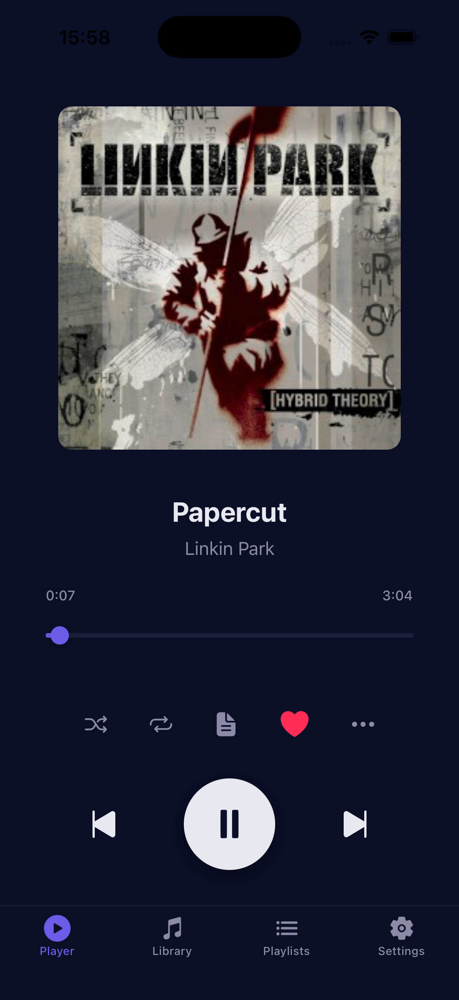
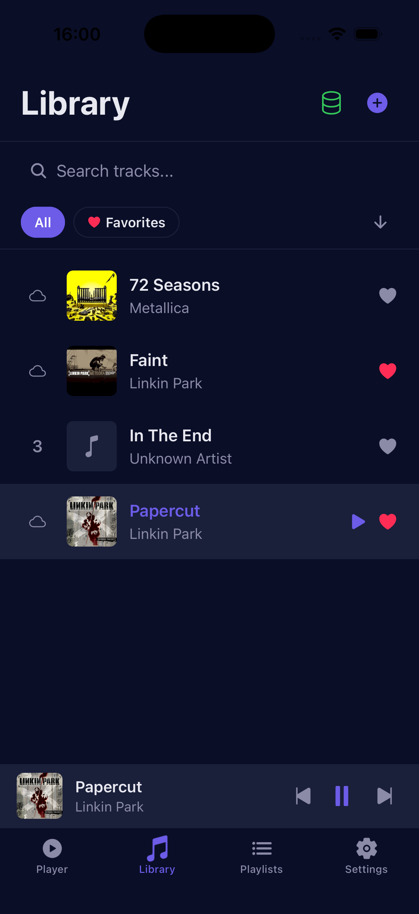
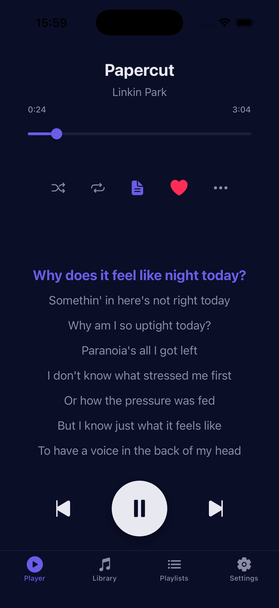
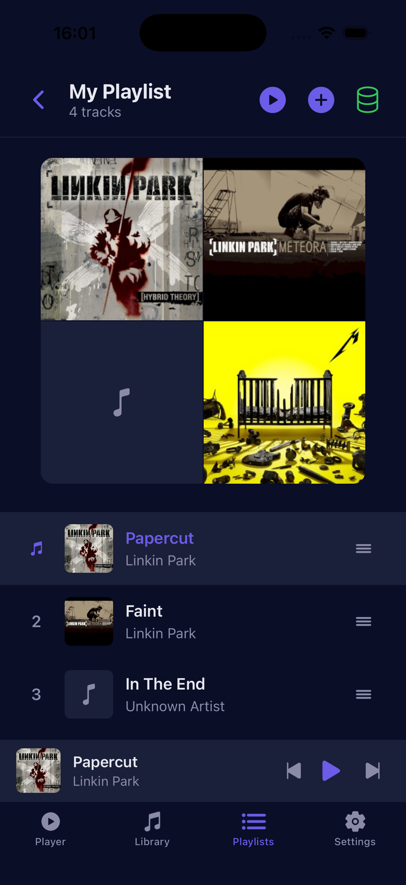
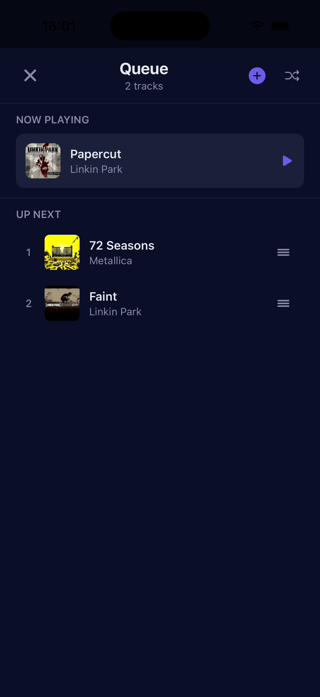
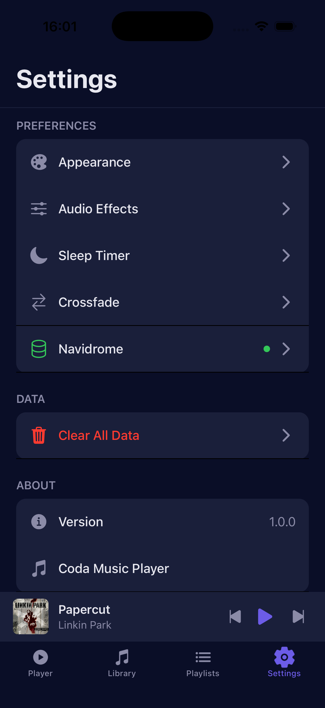

<div align="center">


# Coda

**Your music. Your way.**

A beautifully crafted music player for iOS with local library management, Navidrome streaming, crossfade, synced lyrics, and full theming support.


[Features](#features) &nbsp;&bull;&nbsp; [Tech Stack](#tech-stack) &nbsp;&bull;&nbsp; [Getting Started](#getting-started) &nbsp;&bull;&nbsp; [Architecture](#architecture) &nbsp;&bull;&nbsp; [License](#license)

</div>

---

## Features

| | Feature | Description |
|---|---------|-------------|
| 🎵 | **Local Library** | Import audio files with automatic metadata and artwork extraction |
| 🔗 | **Navidrome Streaming** | Connect to any Subsonic-compatible server to stream your collection |
| 🎧 | **Crossfade** | Smooth transitions between tracks with configurable duration |
| 🎶 | **Gapless Playback** | Seamless transitions with next-track pre-buffering |
| 📱 | **Lock Screen Controls** | Full playback controls in Control Center and on the lock screen |
| 🎨 | **4 Themes** | Dark, Light, Midnight, and Ocean — all with full accent color support |
| 📋 | **Smart Playlists** | Create, rename, reorder, and manage playlists with drag-and-drop |
| ❤️ | **Favorites** | Heart your tracks with play count tracking and filtering |
| 📝 | **Synced Lyrics** | Auto-scrolling lyrics with highlighted current line via LRCLIB |
| ⏰ | **Sleep Timer** | Set a countdown with a smooth 30-second volume fade-out |
| 🔀 | **Queue Management** | Full queue with drag-to-reorder, swipe-to-delete, and library search |
| 🎚️ | **Audio Effects** | EQ presets (Flat, Relaxed, Clear, Upbeat), speed control, and volume |

## Screenshots

<p align="center">
  
  
  
</p>
<p align="center">
  
  
  
</p>

## Tech Stack

| Layer | Technology | Purpose |
|-------|-----------|---------|
| Framework | Expo SDK 54 | Build toolchain and native modules |
| UI | React Native 0.81 | Cross-platform components |
| Language | TypeScript (strict) | Type-safe development |
| Audio Engine | expo-audio | Playback, crossfade, background audio |
| State | React Context | AudioContext + ThemeContext |
| Persistence | AsyncStorage | Library, playlists, queue, settings |
| Navigation | React Navigation | Bottom tabs + stack navigator |
| Lyrics | LRCLIB API | Synced lyrics search and caching |
| Icons | @expo/vector-icons | Ionicons throughout the app |

## Getting Started

### Prerequisites

- Node.js 18+
- Xcode 15+ (for iOS)
- Expo CLI (`npm install -g expo-cli`)

### Installation

```bash
# Clone the repository
git clone https://github.com/Graphicsprocessingunit/Coda.git
cd Coda

# Install dependencies
npm install

# Generate native iOS project
npx expo prebuild --clean

# Install iOS pods
cd ios && pod install && cd ..
```

### Running

```bash
# Start Expo dev server
npx expo start

# Run on iOS simulator
npx expo run:ios
```

<details>
<summary><strong>Building for Production</strong></summary>

```bash
# Using EAS Build
eas build --platform ios --profile production

# Or using local build
eas build --platform ios --profile production --local
```

</details>

## Architecture

<details>
<summary><strong>Click to expand architecture overview</strong></summary>

```
App.tsx                          # Root navigator, tab screens
├── src/
│   ├── components/
│   │   ├── Player.tsx           # Full-screen player with lyrics
│   │   ├── MiniPlayer.tsx       # Floating mini-player overlay
│   │   ├── TrackList.tsx        # Library view with search/filter
│   │   ├── Queue.tsx            # Queue management with drag-reorder
│   │   ├── Playlists.tsx        # Playlist list with create/rename
│   │   ├── PlaylistDetail.tsx   # Playlist tracks with add/reorder
│   │   ├── Settings.tsx         # Settings with slide-up modals
│   │   ├── LyricsDisplay.tsx    # Synced lyrics auto-scroll
│   │   ├── ProgressBar.tsx      # Animated seek bar
│   │   ├── SwipeableRow.tsx     # Swipe-to-delete gesture
│   │   ├── SkeletonLoader.tsx   # Shimmer loading placeholders
│   │   ├── EmptyState.tsx       # Animated empty state with CTAs
│   │   ├── ErrorBoundary.tsx    # Crash recovery UI
│   │   └── TrackInfo.tsx        # Song metadata modal
│   ├── context/
│   │   ├── AudioContext.tsx      # Audio engine, queue, library state
│   │   └── ThemeContext.tsx      # 4-theme system with persistence
│   └── services/
│       ├── StorageService.ts     # AsyncStorage persistence layer
│       ├── FilePickerService.ts  # File import with metadata extraction
│       ├── NavidromeService.ts   # Subsonic API client
│       └── LyricsService.ts      # LRCLIB lyrics search + cache
```

### Key Design Decisions

- **Two AudioPlayer instances** for crossfade: an outgoing player and an incoming player with a volume ramp
- **Pre-buffering**: Next track's player is created ahead of time for gapless transitions
- **Library-as-source**: When queue is exhausted, falls back to the library for continuous playback
- **Lock screen integration**: Uses `expo-audio`'s `setActiveForLockScreen` with metadata and seek controls

</details>

## Contributing

This is a proprietary project. Contribution inquiries should be directed to the maintainer.

## License

Copyright (c) 2025 Graphicsprocessingunit. All Rights Reserved. See the [LICENSE](LICENSE) file for details.

---

<div align="center">

**Built with care by [Graphicsprocessingunit](https://github.com/Graphicsprocessingunit)**

If you enjoy Coda, please consider giving it a ⭐

</div>
